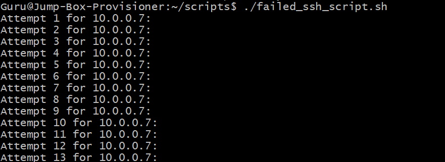
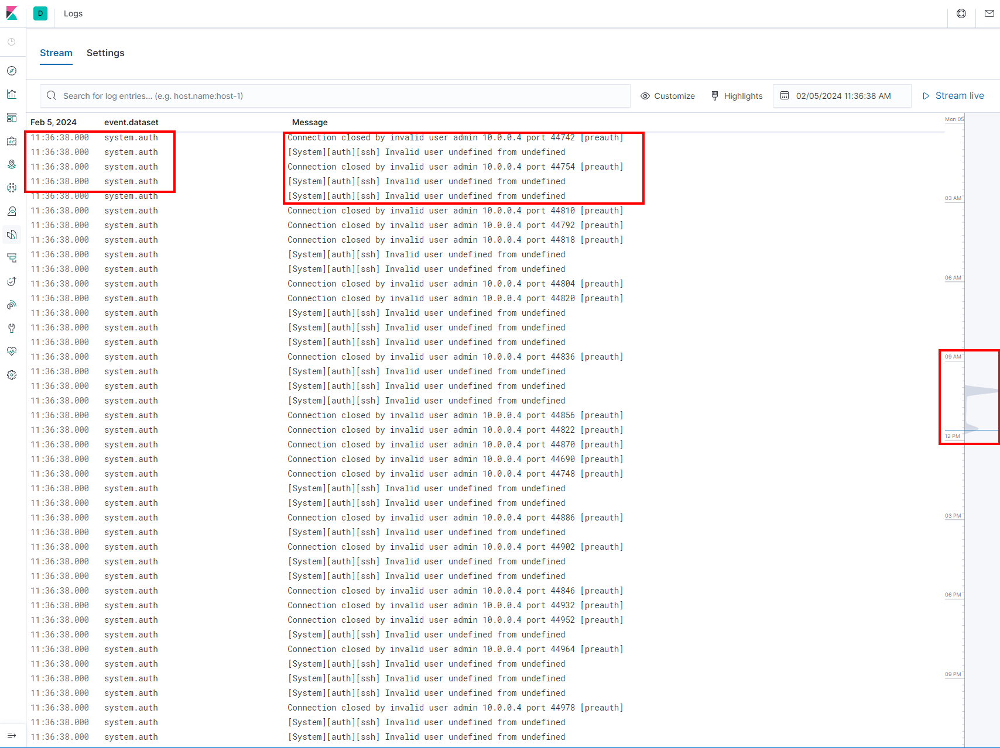
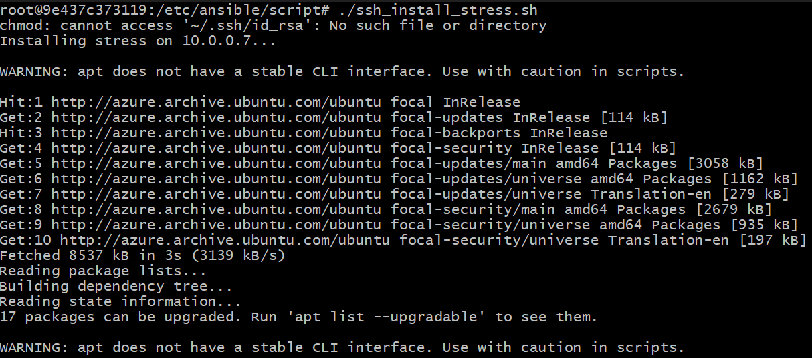
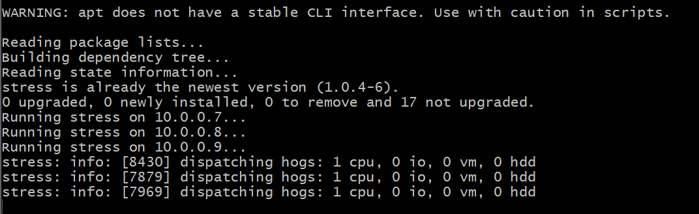
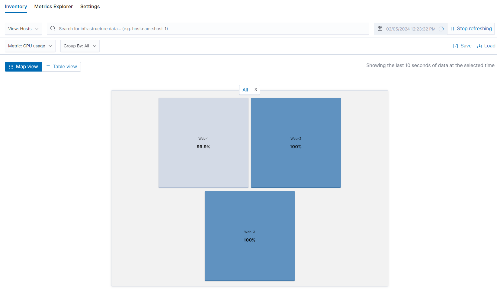
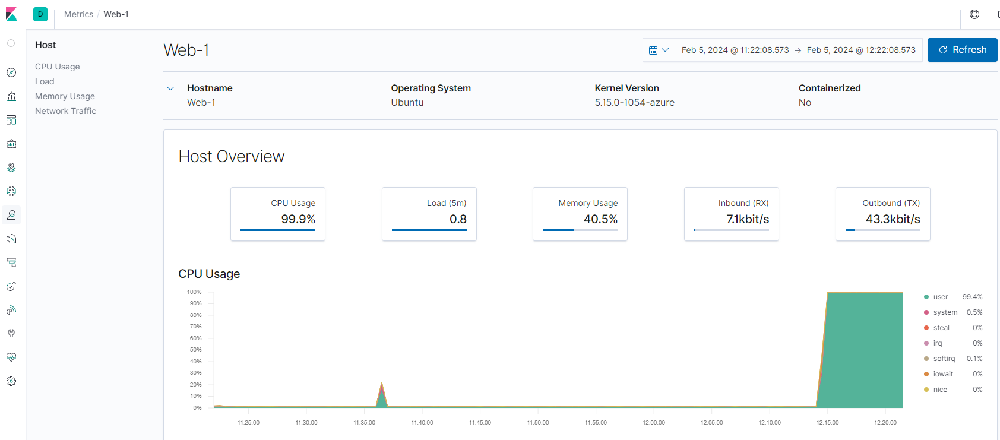
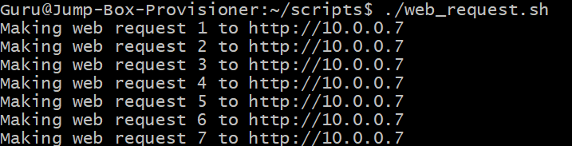
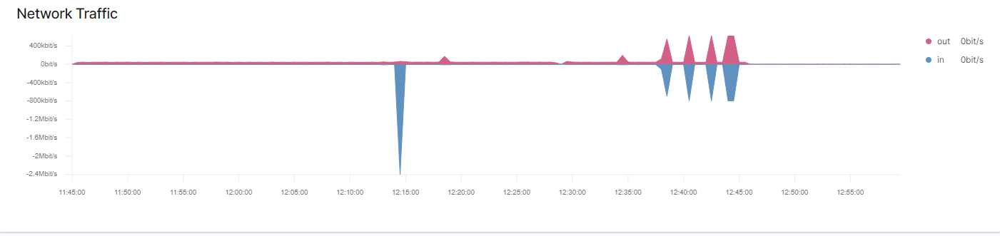
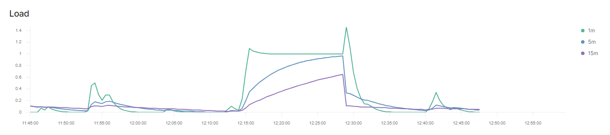

## Automated ELK Stack Deployment

Before the automated ELK Stack Deployment, the ELK stack was built upon a cloud redundancy setup. It was built in the following order:

1. Created a Resource Group.
2. Created a Virtual Network.
3. Established an inbound rule in the NSG (Network Security Group) to block all traffic.
4. Created the Jump Box and added an SSH key to it.
5. Deployed three web VMs.
6. Added an inbound security rule to allow SSH into the Jump Box.
7. Installed Docker.io on the Jump Box and pulled an image.
8. Added another inbound security rule for the Jump Box to access other VMs in the Vnet.
9. Added the Jump Box container's SSH key to the other VMs for SSH access.
10. Edited the Ansible host file to include the private IP addresses of the three VMs.
11. Edited the Ansible.cfg file to specify the correct SSH username.
12. Created a playbook to install DVWA on all three VMs.
13. Configured a load balancer with a front-end IP, backend pool, and health probes.
14. Deleted the inbound rule to deny all traffic and added a new rule to allow only my connection by HTTP.

With that, I could access the Load Balancer IP, and I was redirected to the DVWA VMs. To test redundancy, I turned one of the VMs off, leaving the other two running, and I could still access the VMs.

The files in this repository were used to configure the network depicted below.


These files have been tested and used to generate a live ELK deployment on Azure. They can be used to either recreate the entire deployment pictured above. Alternatively, select portions of the **playbook** file may be used to install only certain pieces of it, such as Filebeat.

  - install-elk.yml
```
---
- name: Configure Elk VM with Docker
  hosts: elk
  remote_user: Guru
  become: true
  tasks:
    # Use apt module
    - name: Install docker.io
      apt:
        update_cache: yes
        name: docker.io
        state: present

      # Use apt module
    - name: Install pip3
      apt:
        force_apt_get: yes
        name: python3-pip
        state: present

      # Use pip module
    - name: Install Docker python module
      pip:
        name: docker
        state: present

      # Use sysctl module
    - name: Use more memory
      sysctl:
        name: vm.max_map_count
        value: "262144"
        state: present
        reload: yes

      # Use docker_container module
    - name: download and launch a docker elk container
      docker_container:
        name: elk
        image: sebp/elk:761
        state: started
        restart_policy: always
        published_ports:
          - 5601:5601
          - 9200:9200
          - 5044:5044

      # Use systemd module
    - name: Enable service docker on boot
      systemd:
        name: docker
        enabled: yes  
```


This document contains the following details:
- Description of the Topology
- Access Policies
- ELK Configuration
  - Beats in Use
  - Machines Being Monitored
- View Logs that are being made
### Description of the Topology

The main purpose of this network is to expose a load-balancer and monitored instance of DVWA, the Vulnerable Web Application.

Load balancing ensures that the application will be highly **available** in addition to restricting **inbound access** to the network.
- The load balancer ensures that the incoming traffic will be processed and share by all three vulnerable web servers. Access controls are set in place to only authorized my connection to the web servers.

Integrating an ELK server allows users to easily monitor the vulnerable VMs for changes to the **file systems of the VMs on the network**, as well as watch **system metrics**, such as CPU usage; attempted SSH logins; `sudo` escalation failures; etc.

- _What does Filebeat watch for?_
	- Filebeat watches log files for changes and is used for forwarding log data in a centralized logging system

- _What does Metricbeat record?_
	- Metricbeat records CPU, Memory, Disk, Network and file system metrics.  

| Name | Function | IP Address | Operating System |
| ---- | ---- | ---- | ---- |
| Jump Box | Gateway | 10.0.0.4 | Linux |
| Web 1 | Web Server | 10.0.0.7 | Linux |
| Web 2 | Web Server | 10.0.0.8 | Linux |
| Web 3 | Web Server | 10.0.0.9 | Linux |
| Elk Server | Monitoring | 10.1.0.5 | Linux |

In regards to the table above, Azure has provisioned a **load balancer** in front of all machines except for the jump box. The load balancer targets are organized into the following availability zones:
 - **Availability Zone 1**: Web 1 + Web 2 + Web 3
 - **Availability Zone 2**: ELK Server
### Access Policies

The machines on the internal network are not exposed to the public Internet. 

_Only the **Jump Box** machine can accept connections from the Internet. Access to this machine is only allowed from the following IP addresses:_
- **My Public IP address which I will not share**. 

Machines within the network can only be accessed by **one another**. The Web 1, Web 2, and Web 3 VMs send traffic to the ELK server.

- _Which machine did you allow to access your ELK VM? What was its IP address?_
	- The only VM that can SSH into the ELK Server is the Jump Box with the private IP address of 10.0.0.4.

A summary of the access policies in place can be found in the table below.

| Name | Publicly Accessible | Allowed IP Addresses |
| ---- | ---- | ---- |
| Jump Box | Yes | My Public IP only |
| Web 1 | No | 10.0.0.0/16 |
| Web 2 | No | 10.0.0.0/16 |
| Web 3 | No | 10.0.0.0/16 |
| ELk Server | No | 10.1.0.0/16 |

### Elk Configuration

Ansible was used to automate configuration of the ELK machine. No configuration was performed manually, which is advantageous because...
- _What is the main advantage of automating configuration with Ansible?_
	- Using Ansible for configuration automation ensures consistency, reduces errors, and improves efficiency by automating tasks, all while providing auditability through code-based documentation.

_The playbook implements the following tasks:_
- Use the `apt` module to update the package cache and install Docker by specifying the package name as "docker.io."
- Use the `apt` module to install Python3-pip, a dependency for managing Python packages.
- Use the `pip` module to install the Docker Python module, enabling Ansible to interact with Docker.
- Use the `command` module to run the sysctl command, adjusting the virtual memory settings (`vm.max_map_count`) to 262144.
- Use the `docker_container` module to download and launch a Docker container named "elk" with the specified image "sebp/elk:761."
- Set the container state to "started" with a restart policy of "always."
- Publish the necessary ports (5601, 9200, 5044) to allow access to Kibana, Elasticsearch, and Logstash.

The following screenshot displays the result of running `docker ps` after successfully configuring the ELK instance.


### Target Machines & Beats

_This ELK server is configured to monitor the following machines:_
- Web 1 `10.0.0.7`
- Web 2 `10.0.0.8`
- Web 3 `10.0.0.9`

_We have installed the following Beats on these machines:_
- Filebeat
- Metricbeat
- Packetbeat

_These Beats allow us to collect the following information from each machine:_
- **Filebeat** collects log events from specified files, such as Apache access logs, providing details like IP addresses and requested URLs. 
- **Metricbeat** gathers system-level metrics, such as CPU usage, aiding in performance monitoring. 
- **Packetbeat** analyzes network traffic, capturing packet-level details like protocols and source/destination addresses. For example, if monitoring HTTP traffic, **Packetbeat** can provide insights into accessed URLs and response codes, facilitating network analysis and troubleshooting.

### Using the Playbook
In order to use the playbook, you will need to have an Ansible control node already configured. Assuming you have such a control node provisioned: 

_SSH into the control node and follow the steps below:_
- Copy the **playbook** file to **Jump Box Container**.
- Update the **Hosts** file to include **all IP's of all three Web VM's.**
- Run the playbook, and navigate to **ELK server vm** to check that the installation worked as expected.

- _Which file is the playbook? Where do you copy it?_
	- **Install-elk.yml** was left in the ansible directory. 
	- **Filebeat-playbook.yml** and **metricbeat-playbook.yml** were copy into the files directory. 

- _Which file do you update to make Ansible run the playbook on a specific machine? How do I specify which machine to install the ELK server on versus which to install Filebeat on?_
	- The file that needs updating for Ansible to execute the playbook is the "hosts" file in the Ansible directory. 
	- I successfully added "elk" in brackets at the end of the hosts file with the private IP of the VM I wanted to include in the Elk group. 
	- To install Filebeat, I needed to download the **filebeat-config.yml** file and modify the IP address within that configuration file.

- _Which URL do you navigate to in order to check that the ELK server is running?
	- The URL is `http://20.245.79.240:5601/app/kibana`

### Generating Logs

To generate failed login attempts, SSH from outside the Docker container, which holds the key for accessing VMs. Create a script to attempt logins on all three VMs and the ELK server.

failed_ssh_script.sh
```
#!/bin/bash

REMOTE_USER="admin"

# List of remote hosts
REMOTE_HOSTS=("10.0.0.7" "10.0.0.8" "10.0.0.9" "10.1.0.5")
NUM_ATTEMPTS=500

for host in "${REMOTE_HOSTS[@]}"; do
    for ((i=1; i<=NUM_ATTEMPTS; i++)); do
        echo "Attempt $i for $host:"
        ssh "$REMOTE_USER@$host" 2>/dev/null &
    done
    wait
done
``` 




Accessing Kibana and navigating to the logs section allows us to view the recently attempted failed logins made by the script.




### Linux Stress

Increase CPU usage by installing 'stress' and running `sudo stress --cpu 1`. I've crafted a script for SSH login, stress installation, and executing `sudo stress --cpu 1`, providing a simple way to observe system performance under heightened computational load on all three VMs.

ssh_install_stress.sh
```
#!/bin/bash

REMOTE_USER="Guru"
PRIVATE_KEY_PATH="~/.ssh/id_rsa"

REMOTE_HOSTS=("10.0.0.7" "10.0.0.8" "10.0.0.9")

# Correct the permissions for the private key
chmod 600 "$PRIVATE_KEY_PATH"

# Install stress on remote hosts
for host in "${REMOTE_HOSTS[@]}"; do
    echo "Installing stress on $host..."
    ssh -i "$PRIVATE_KEY_PATH" "$REMOTE_USER@$host" "sudo apt update && sudo apt install -y stress"
done

# Run stress on remote hosts
for host in "${REMOTE_HOSTS[@]}"; do
    echo "Running stress on $host..."
    ssh -i "$PRIVATE_KEY_PATH" "$REMOTE_USER@$host" "sudo stress --cpu 1" &
done

wait
```







- To view the results, go to the Metric page, click on one of the VMs, and select "View Metrics.








### wget-DoS

- Generate a substantial volume of web requests to all three VM servers by using a script that performs 500 wget requests on each server and removes the index.html file.

 web_request.sh
```
#!/bin/bash

# List of remote hosts
REMOTE_HOSTS=("10.0.0.7" "10.0.0.8" "10.0.0.9")

NUM_REQUESTS=500

# Perform web requests and delete index.html file
for host in "${REMOTE_HOSTS[@]}"; do
    for ((i=1; i<=NUM_REQUESTS; i++)); do
        echo "Making web request $i to http://$host"
        wget -q "http://$host" -O index.html
        rm index.html
    done
done
```




- To view the results, go to the Metric page, click on one of the VMs, and select "View Metrics.

- High traffic in both load and networking.




